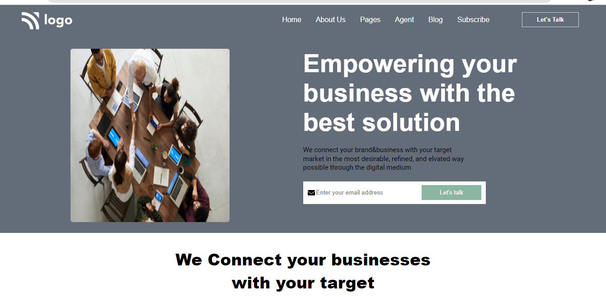
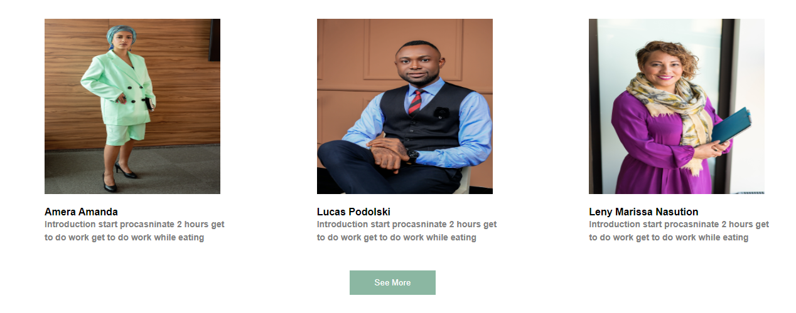

## Anurag Pathak

# Business Landing page

> Project 12

<table>
<tr>
<td>
  A landing page designed using pure HTML & CSS.
</td>
</tr>
</table>

### Skills Gained from this

- Navbar using CSS flexbox.
- Wrote HTML code from scratch for this page.
- Class, tag selector for HTML elements.
- Created cards for displaying contents in better formats.
- gridbox

### Screenshot

## Time taken
10 hours.
